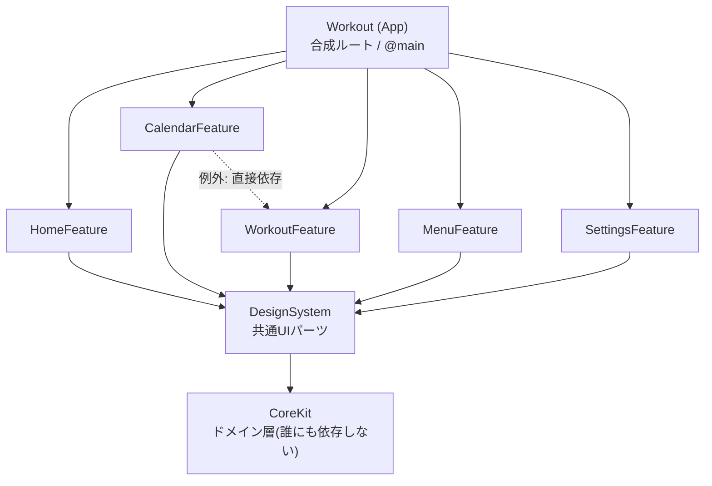
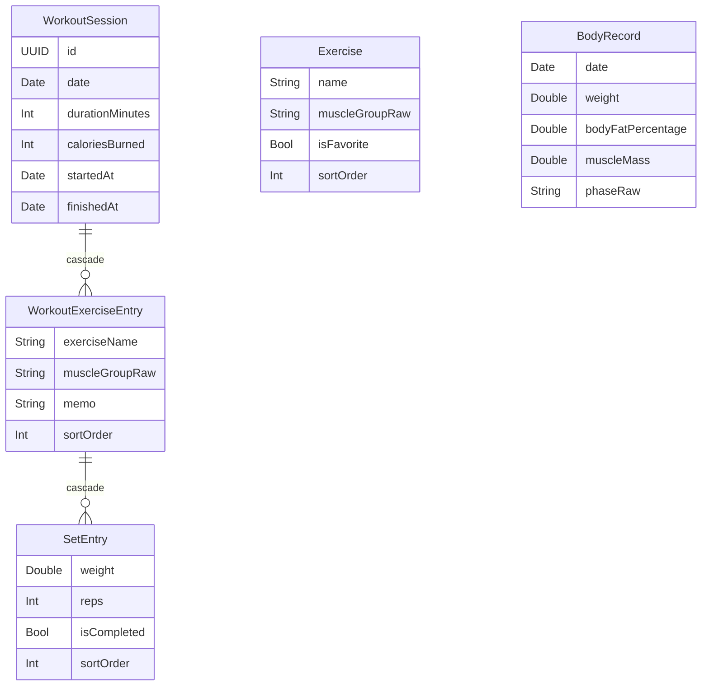

# YOSHIFIT

Tuist で構成したマルチモジュール SwiftUI + SwiftData の筋トレ記録アプリ。

> より詳しいビジュアル版はこちら → [Architecture artifact](https://claude.ai/code/artifact/4299c289-2249-452f-abf4-414bd521118f)（Claude の private artifact。見るには共有設定が必要です）

## アーキテクチャ

### モジュール構成

`Workspace.swift` が8つの `Project.swift` を束ねている。各モジュールは `ProjectHelper.module(name:dependencies:)` で「本体ターゲット + 同名の Tests ターゲット」の対を宣言するだけの薄いラッパー。依存はほぼ一方向で、下にあるものほど「知らない側」。



App は Project.swift 上で CoreKit / DesignSystem にも直接依存しているが、どの Feature 経由でも到達できるため図では省略。CalendarFeature → WorkoutFeature だけが「Feature 同士は依存しない」という原則の唯一の例外で、カレンダーの日付タップから `SessionSummaryView` / `SessionEditorView`（WorkoutFeature 側の画面）へ直接遷移するために存在する。

### ファイル配置の規約

「どこに置くべきか迷わない」ことを優先した、フラットな配置。`Views/` や `ViewModels/` のような技術的な subfolder は作らず、モジュール内はほぼ全て `Sources/` 直下に並ぶ。

```
Projects/
├── App/                          # 合成ルート — RootTabView・@main・アプリ資産だけを持つ
│   ├── Sources/
│   │   ├── WorkoutApp.swift      # @main。ModelContainer の生成、通知デリゲート登録
│   │   └── RootTabView.swift     # TabView 本体。各 Feature を並べるだけ
│   └── Resources/Assets.xcassets/ # AppIcon・BrandMark はここ(DesignSystem ではない)
│
├── Core/
│   ├── CoreKit/Sources/           # SwiftUI を知らないドメイン層(import SwiftUI 禁止)
│   │   ├── WorkoutSession.swift   # @Model 3種を1ファイルにまとめている
│   │   ├── Exercise.swift / BodyRecord.swift
│   │   ├── MuscleGroup.swift / TrainingPhase.swift  # enum
│   │   ├── RestStatus.swift       # 休息判定ロジック(RestDayCalculator)
│   │   ├── RestDayTargetStore.swift / RestTimerSettingsStore.swift  # UserDefaults
│   │   ├── AppRouter.swift        # タブ横断のナビゲーション状態
│   │   ├── TrainingOverdueNotifier.swift  # ローカル通知の組み立て
│   │   └── PersistenceController.swift / AppLogger.swift
│   │
│   └── DesignSystem/Sources/      # 再利用 SwiftUI パーツと見た目トークン
│       ├── AppColor.swift / AppSpacing.swift / AppBrand.swift
│       ├── BrandHeader.swift / CardContainer.swift / SectionHeader.swift
│       └── CircularRestGauge.swift / WeeklyMinutesChart.swift
│
└── Features/<Name>Feature/        # 5モジュール、全て同じ形
    ├── Project.swift              # ProjectHelper.module(name:, dependencies:) の1行呼び出し
    ├── Sources/
    │   ├── <Name>View.swift       # public struct、画面ごとに1ファイル
    │   └── <Name>ViewModel.swift  # @Observable、View と1対1
    └── Tests/
```

主なルール:

- **「モデル / ロジック」= CoreKit、「見た目」= DesignSystem、「画面」= Feature** の3層構造が唯一のルール。SwiftData の `@Model`、UserDefaults ベースのストア、通知ロジックなど UI を持たないものは全部 CoreKit に置く。これにより CoreKit は誰にも依存しない「葉」モジュールを保てる。
- 画面は View + ViewModel のペアを同じ `Sources/` に並べる。サブフォルダで種類分けしない(例: `CalendarView.swift` と `CalendarViewModel.swift` は両方 `CalendarFeature/Sources/` 直下)。
- 画面固有の小さな下位ビュー(シート、行、カードなど)は同じファイル内に `private struct` で入れ子にする(例: `SessionEditorView.swift` 内に `ExerciseEntryCard` / `SetRow` / `SessionActionMenuSheet` が同居)。
- アプリ資産(AppIcon・BrandMark)は App 側の `Assets.xcassets` に置く。DesignSystem には置かない(`Image("BrandMark", bundle: .main)` が `Bundle.main` で解決できるのは、実体が App ターゲットの中にあるから)。
- シングルトンは `static let shared` を持つ最終クラスとして CoreKit に置き、呼び出し側は初期値のデフォルト引数として受け取る(例: `init(restDayTargetStore: RestDayTargetStore = .shared)`。テスト時は差し替え可能)。

### データモデル(SwiftData)

全て `Core/CoreKit/Sources/` に定義。トレーニング記録は3階層の cascade delete、それ以外は単独モデル。



部位(`muscleGroupRaw`)は `MuscleGroup` enum の rawValue として保存し、計算プロパティ経由で復元している(`CaseIterable`、7種)。増減期は同様に `TrainingPhase` enum。`Exercise` と `BodyRecord` は他のモデルと関連を持たない独立モデル。

### 横断的な状態管理

`@Model` ではないが、複数の Feature をまたいで参照される「その他の状態」。全て CoreKit の `static let shared` シングルトン。

| 名前 | 永続化 | 役割 |
| --- | --- | --- |
| `RestDayTargetStore` | UserDefaults | 部位ごとの休息目標日数。設定タブで編集し、ホームの休息ゲージと通知判定の両方から参照される。 |
| `RestTimerSettingsStore` | UserDefaults | 休憩タイマーのポップアップ表示・アラーム音のオン/オフ設定。 |
| `AppRouter` | メモリのみ(`@Observable`) | 選択中タブと「カレンダーに遷移したい日付」を保持し、Feature モジュール間のタブ切替を仲介する。 |
| `TrainingOverdueNotifier` | なし(静的関数) | 各部位の休息超過を `RestDayCalculator` で判定し、超過があれば翌8:00のローカル通知を再スケジュールする。 |

これらは SwiftData の `ModelContainer` とは無関係な、アプリ内メモリ / UserDefaults の状態。永続化が必要なデータ(記録そのもの)は必ず `@Model` 側に置く、という線引きを保っている。

### 画面遷移・通知の流れ

Feature 同士が直接呼び合わない代わりに、CoreKit の共有状態(`AppRouter`・`TrainingOverdueNotifier`)を介して間接的に協調する2つの代表的な流れ。

**A. トレーニング終了 → カレンダーへ自動遷移**

`SessionEditorView`(「終了」をタップ) → `WorkoutCompletionView`(完了画面を fullScreenCover) → `AppRouter.showCalendar(for:)`(タブ選択 + 遷移先日付を設定) → `CalendarView`(onChange で検知し当日を選択表示)

**B. 休息目標の超過通知**

起動 / トレーニング終了 / 目標変更のいずれか → `TrainingOverdueNotifier` が部位ごとに `RestDayCalculator` を実行 → 超過があれば通知本文を組み立て → `UNCalendarNotificationTrigger` で翌8:00に一度だけ再登録

※ B は non-repeating トリガーのため、内容を最新に保つには再スケジュールの呼び出しが必要。アプリを開かないまま数日経つと、その間の通知内容は最後に開いた時点のまま固定される。
